<!-- ═══════════════════════════════════════════════════════════════════ -->

<div align="center">

<a href="https://github.com/GboyeStack-Robotics-ML-Engineer">
  
</a>

<br/>


&nbsp;&nbsp;

&nbsp;&nbsp;


</div>

<br/>


<!-- ═══════════════════════════════════════════════════════════════════ -->
<!-- ABOUT ME                                                          -->
<!-- ═══════════════════════════════════════════════════════════════════ -->

<h2 align="center">&nbsp; About Me</h2>

<br/>

<table align="center" border="0" cellpadding="0" cellspacing="0">
<tr>
<td width="55%" valign="top">

```yaml
name: Samuel Adegboyega
located_in: Nigeria 🇳🇬
role: ML Engineer & Robotics Enthusiast

current_focus:
  - 🔭  Deep Learning & Computer Vision systems
  - 🤖  Real-Time Object Detection (YOLO)
  - 🧠  Vision Transformers & LLMs
  - 🌱  MLOps & Edge Deployment

interests:
  - Generative AI & Diffusion Models
  - Autonomous Systems & Robotics
  - Open Source Contributions

fun_fact: >
  I debug with print() first,
  logging second 😄
```

</td>
<td width="45%" align="center" valign="middle">


</td>
</tr>
</table>

<br/>


<!-- ═══════════════════════════════════════════════════════════════════ -->
<!-- TECH STACK                                                        -->
<!-- ═══════════════════════════════════════════════════════════════════ -->

<h2 align="center">&nbsp; Tech Arsenal</h2>

<br/>

<div align="center">

</div>

<br/>


<!-- ═══════════════════════════════════════════════════════════════════ -->
<!-- SPOTLIGHT PROJECTS                                                -->
<!-- ═══════════════════════════════════════════════════════════════════ -->

<h2 align="center">&nbsp; Spotlight Projects</h2>

<br/>

<div align="center">

<!-- Animated Projects Carousel -->
<a href="https://github.com/GboyeStack-Robotics-ML-Engineer?tab=repositories">
  
</a>

<br/><br/>

<!-- Clickable Repo Links -->
<a href="https://github.com/GboyeStack-Robotics-ML-Engineer/SPAM-DETECTION"></a>
&nbsp;
<a href="https://github.com/GboyeStack-Robotics-ML-Engineer/VIT---Transformers"></a>
&nbsp;
<a href="https://github.com/GboyeStack-Robotics-ML-Engineer/YOLO-OBJECT-DETECTION"></a>
&nbsp;
<a href="https://github.com/GboyeStack-Robotics-ML-Engineer/MINI-GPT"></a>


</div>

<br/>


<!-- ═══════════════════════════════════════════════════════════════════ -->
<!-- GITHUB STATS                                                      -->
<!-- ═══════════════════════════════════════════════════════════════════ -->

<h2 align="center">&nbsp; GitHub Analytics</h2>

<br/>

<div align="center">

<a href="https://github.com/GboyeStack-Robotics-ML-Engineer">
  
</a>
&nbsp;
<a href="https://github.com/GboyeStack-Robotics-ML-Engineer">
  
</a>

<br/><br/>

<a href="https://github.com/GboyeStack-Robotics-ML-Engineer">
  
</a>

<br/><br/>

<a href="https://github.com/GboyeStack-Robotics-ML-Engineer">
  
</a>

</div>

<br/>


<!-- ═══════════════════════════════════════════════════════════════════ -->
<!-- CONTRIBUTION SNAKE                                                -->
<!-- ═══════════════════════════════════════════════════════════════════ -->

<h2 align="center">🐍 Contribution Snake</h2>

<br/>

<div align="center">
<picture>
  <source media="(prefers-color-scheme: dark)" srcset="https://raw.githubusercontent.com/GboyeStack-Robotics-ML-Engineer/GboyeStack-Robotics-ML-Engineer/output/github-snake-dark.svg" />
  <source media="(prefers-color-scheme: light)" srcset="https://raw.githubusercontent.com/GboyeStack-Robotics-ML-Engineer/GboyeStack-Robotics-ML-Engineer/output/github-snake.svg" />
  
</picture>
</div>

<br/>


<!-- ═══════════════════════════════════════════════════════════════════ -->
<!-- TROPHIES                                                          -->
<!-- ═══════════════════════════════════════════════════════════════════ -->

<h2 align="center">🏆 GitHub Trophies</h2>

<br/>

<div align="center">

</div>

<br/>


<!-- ═══════════════════════════════════════════════════════════════════ -->
<!-- CONNECT                                                           -->
<!-- ═══════════════════════════════════════════════════════════════════ -->

<h2 align="center">&nbsp; Let's Connect!</h2>

<br/>

<div align="center">

<a href="https://linkedin.com/in/yourprofile"></a>
&nbsp;&nbsp;
<a href="https://kaggle.com/yourprofile"></a>
&nbsp;&nbsp;
<a href="https://medium.com/@yourprofile"></a>
&nbsp;&nbsp;
<a href="mailto:your.email@gmail.com"></a>

<br/><br/>


</div>

<br/>

<!-- ═══════════════════════════════════════════════════════════════════ -->


